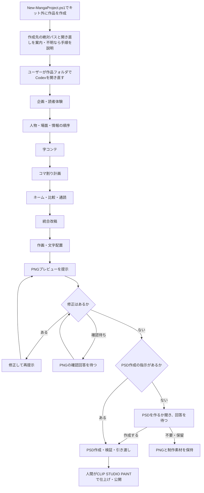

# 漫画制作キット

Codexと一緒に漫画を企画し、字コンテ・ネーム・作画・PNGでの確認を進めるための知識、9つのスキル、作品テンプレートです。

**このフォルダは制作キットの保守・配布用です。漫画は原則ここで描かず、`scripts/New-MangaProject.ps1` でキット外に個別プロジェクトを作成し、そちらでCodexを開き直して制作します。** `templates/manga-project/` は原本なので、直接作品を書き込まないでください。

尚、このリポジトリのURLを ChatGPT Work に指定して漫画のキャラクターやストーリーを指定するだけでも、おおよその機能を利用することができます。

## できること

個別プロジェクトを開いた後、次の制作を進められます。

- 読者体験と物語を設計し、字コンテからネームへ具体化する。
- コマ割りテンプレート集（全79種類）を基本に、演出に合わせてページを設計する。
- 物語、没入、映画的演出、読みやすさ、用語、キャラクターの一貫性をレビューする。
- 場面で狙う笑い・魅力・感情・関係・展開について、監修スキルから字コンテの表現案とプレビュー後の改善案を得る。
- 利用可能な画像生成・編集環境を使って作画し、PNGで確認・修正する。
- PNGの修正がなくなったら、作成指示のあるPSDを作成・検証して引き渡す。
- 動画で演出を試す依頼がある場合に、ローカルComfyUIの生成・回収と動画編集を補助する。

## 制作の流れ



工程ごとの成果物と確認点は[制作プロセス](docs/knowledge/manga/08-workflow-review.md)、知識と雛形は[ノウハウ一覧](templates/manga-project/docs/MANGA-KNOWHOW.md)にまとめています。「このフォルダで何ができるか」の説明も、個別プロジェクトを作って開き直す流れから始めます。

## はじめ方

Windows PowerShell 5.1以上で、リポジトリのルートから実行します。

```powershell
.\scripts\New-MangaProject.ps1 -ProjectName '作品名' -WhatIf
.\scripts\New-MangaProject.ps1 -ProjectName '作品名'
```

既定の作成先は `../作品名/`。別の親フォルダを使う場合は、キット外に作成される既存の相対パスを `-DestinationParent` で指定します。リポジトリのフォルダ名は自由に変更できます。既存の作品は上書きしません。`-WhatIf` は配置の確認だけで、プロジェクトを作成しません。

作成成功時にスクリプトが**作成先の絶対パス**と、そこでCodexを開き直すメッセージを表示します。Codexが作成した場合も、作成先の実在を確認し、ユーザーへの返信にはクリック可能なMarkdownリンクと、同じ絶対パスをそのままコピーできる文字列を併記します。これは開き直すための表示であり、文書・設定・保存記録は相対パスを使います。

### 作成したプロジェクトでCodexを開き直す

Codexは作成完了時に「このフォルダでCodexを開き直してください」と案内し、**「やり方がわからない場合は、ご利用の環境（Windows／Mac、アプリ／VS Code）を教えてください。必要な手順をご案内します」**と添えます。手順がわかる場合は返信せず、そのまま作品フォルダを開いて構いません。作成のたびに操作手順を調べることはせず、手順を求められた場合だけ、利用環境に合う最新の公式情報を検索・閲覧し、出典URLと確認日を付けて説明します。詳しくは[Codexでの開き直し](docs/knowledge/codex-operation.md#作品フォルダでcodexを開き直す)を参照してください。

表示された絶対パスの作品フォルダをアプリまたはVS Codeで開き、そこで新しいCodexの会話を始めます。作成スクリプトの実行だけでは、今の会話の作業フォルダは切り替わりません。作品側の `AGENTS.md`、`project.json`、`docs/PLAN.md`、`docs/PROGRESS.md` を確認してから、`docs/story/BRIEF.md` に狙いを記して制作を始めます。制作に使う共通知識とスキルは作品側へコピーされます。ただし、NovelAIの画風見本はキット側の `resources/novelai-style-samples/index.html` を参照するため、見本を使う場合はキットも保持してください。既存作品を再開する場合は、新規作成せずその作品フォルダを開きます。

### どうしてもこのキット内で漫画を作る場合の例外

通常は上記の個別プロジェクトを使います。ユーザーがどうしてもキット内で制作したいと明示した場合だけ、次の手順に進みます。

1. ユーザー自身がテキストエディターなどで、このキットのルートに `特別な理由でこのフォルダの中で漫画を作ります.txt` を作成します。拡張子の重複や別名になっていないことを確認してください。
2. Codexはその名前の通常のファイルが実在することを確認します。ファイルがない間は制作を始めません。Codexによる代作・コピー・生成コマンドの実行は行いません。
3. キット内で作るというユーザーの明示指示とファイルの存在がそろったら、例外として制作を始めます。ファイルが置かれているだけでは制作依頼と扱いません。

このファイルは雛形や新規作品へ配布せず、Gitのコミット対象から除外します。例外で作る素材・原稿も公開対象外の `.work/` などに保存し、共通知識・スキル・作品雛形へ混ぜません。キット自体の文書・スクリプトの修正や配布テストには、この例外ファイルは不要です。

## 利用範囲

画像生成ツール、PSDを作成・再読込する手段、CLIP STUDIO PAINT、モデル本体は同梱していません。必要な環境を確認して進める手順を提供します。動画補助処理にはPython 3.10以上、編集にはffmpegとffprobeが必要です。

PSD作成の指示がなければ、PNGでの修正確認後に作るか質問して回答を待ちます。既に指示がある場合は再確認しません。CBZは明示指定時だけ作成します。フィードバックは「残してほしい」と依頼された場合だけ記録し、記録するかの確認はしません。

## よくある質問（FAQ）

### Q. このキットを使って作成した漫画を公開してよいですか？ また、キットを利用したことを記載（クレジット表記）する必要はありますか？
**A.** はい、公開していただけます。本キットを利用して作成された漫画作品について、本リポジトリの作者は、本キットを利用したことを理由として成果物に対する権利や追加の利用制限を主張しません。また、本キットを利用して漫画を作成したことのクレジット表記も任意であり、記載してもしなくても構いません。

ただし、政治的思想が強い内容や他者への攻撃性が強い内容を含む作品を公開される場合は、本キットとの関連を示すクレジット表記等はお控えいただけますと幸いです。これは利用を制限する条件ではなく、本リポジトリ作者からのお願いです。

なお、二次創作をはじめ、第三者の著作物・キャラクター・素材等を扱う場合は、それぞれの権利者が定めるガイドラインや利用条件をご確認ください。また、本キットは制作過程で各種AIサービスを利用することを前提としているため、利用するサービスやモデル等に適用される利用条件についても、利用者ご自身でご確認ください。

### Q. ChatGPTのどのモデルで使えばよいですか？
**A.** 作者は「ChatGPT Pro」プランにて「Astra ExtraHigh（極高）」を指定して試作・運用しています。「Astra Ultra」でも検証を行いましたが、体感上の大きな差異は見られず、主に利用枠の消費が増加する印象でした。  
なお、SNS（X）上では「ChatGPT Plus」プランのWork画面にて、5時間制限の範囲内で16〜18ページ程度作成できたという報告もあります。

※上記は作者の環境・執筆時点での使用感、または執筆時点のSNS上の情報です。ChatGPTのモデル名称、利用可能な推論設定、利用上限等は今後変更される可能性があります。

※処理内容の複雑さや、Astra側の性能・制限の増減によって変動する可能性がある点にはご注意ください。

### Q. 制作開始時に指定できるパラメーターはありますか？
**A.** 作品プロジェクト内の `OPTION.md` をご参照ください。コマ割りテンプレートの利用有無、コマ数別の採用率、横長3段の反復制限、文字方向、PSD作成などのオプションが指定可能です。  
各設定によって実際にどのように挙動が変わるかについては、制作開始時などに `OPTION.md` についてCodexへ直接質問すると、各設定の内容について確認することもできます。
特に指定しない場合はデフォルト設定で動作します。

### Q. version 0.4.0の主な変更点と使い方を教えてください。

**A.** 主な変更は次の5点です。

以下の依頼例は、作品プロジェクトを作成し、そのフォルダでCodexを開いてから使ってください。基本はキャラ・あらすじ・ページ数を伝えれば、Web公開用の漫画制作を進められます。設定ファイルをすべて埋める必要はなく、希望は会話でも指定できます。

**【ご注意】Gemini（agy）による日本語推敲やNovelAI APIの利用を選んだ場合は、対象の文章・生成指示などを外部サービスへ送信し、各サービスの利用枠や料金が発生することがあります。利用するサービス・送信対象・費用条件を確認してください。Geminiの利用枠消費は導入前に確認し、NovelAIでAnlasを消費する生成は明示された指示の範囲で行う方針です。これらのオプションは、期待する表現や品質向上を保証するものではありません。**

1. **場面に合わせた監修（supervision）機能の追加**

   ギャグ、ツッコミ、恋愛、恐怖、逆転など、16テーマの監修知識を追加しました。字コンテでの表現相談と、PNGプレビューを見た改善提案に使えます。

   **使い方：** 「この場面は照れと好意が伝わるように監修して」「このページのギャグが伝わるか、PNGを見て改善案を出して」のように、対象の場面と狙いたい効果を伝えてください。専門的なスキル名を指定する必要はありません。

   ギャグ以外の15テーマは試行版です。一般的な読者効果は未検証のため、作品ごとのPNGや試読で確かめます。

   尚、確実に利用されるとも限らず、品質として向上するとも限らない点はご注意ください。

2. **コマ割りとページ生成の改善**

   コマ割りテンプレートを基本としつつ、演出に必要なページでは独自の配置を選べるようにしました。imagegenでは番号付きのレイアウト画像を参照させ、ページ全体を一括生成する手順を整備しました。生成後はコマの配置・読み順・台詞を確認します。

   **使い方：** 通常は追加指定なしで使えます。希望がある場合は「見せ場のページは独自のコマ割りにして」「全ページでテンプレートを必須にして」「テンプレートを使わず自由に設計して」と伝えてください。作品の `OPTION.md` にある「コマ割りテンプレート」でも設定できます。詳しくは[コマ割りテンプレートの使い方](docs/knowledge/panel-layout-policy.md)を参照してください。

   ※version 0.3 でもコマ割りテンプレートは入っていましたが、Codexが使わない挙動になりがちだったため、より確実性を上げるよう修正しました。

3. **NovelAIを使った素材生成・ページ組み立ての支援**

   NovelAIで絵を生成し、Codexでコマ枠・フキダシ・文字を配置する制作手順を追加しました。10種類の画風見本と114枚の透過オノマトペ素材を用意し、素材の色替えや、未加工の原画を保持するPSD出力にも対応しました。

   **使い方：** 新規の漫画プロジェクトを作成後、NovelAI公式ページのアカウント設定から永続的APIトークンを取得し、作品フォルダの `.env` の `NOVELAI_API_KEY` に設定してください。`.env.example` は項目名の見本なので、実際のキーは記入しないでください。その後、「絵はNovelAIで生成し、枠と文字は後から配置して」と依頼してください。

   画風が未指定なら、Codexが見本ファイルの場所を案内します。利用者がブラウザーで開き、使いたい画風のIDを伝えてください。Codexは選択を待ってから作画を開始します。詳細は[NovelAIでの制作手順](templates/manga-project/docs/knowledge/novelai-composed-production.md)を参照してください。

   PSDも必要な場合は「PNG確認後、原画を残し、絵・フキダシ・文字を分けたPSDも作って」と伝えてください。PNGの修正確認後に作成します。画像化した文字については、台詞原文も添えて引き継ぎます。

   **APIキーを保存したファイルは、実行権限のあるCodexや接続処理から読み取られる可能性があります。本キットではCodexに、キーの値を回答・ログ・共有ファイルへ書き出さないよう指示しています。ただし、これはCodexの動作方針であり、意図しない出力や漏洩を完全に防ぐ保証ではありません。Gitの除外設定も、Codexからの読み取りを防ぐものではありません。** 漏洩が疑われる場合は、利用者がNovelAI側でトークンを再発行し、利用先の設定を更新してください。新規トークン発行で旧トークンが無効になります。[公式のトークン取得・更新手順](https://docs.novelai.net/ja/text/usersettings/account/)（確認日：2026-09-21）。

4. **自分の必須工程を登録・引き継ぐ機能の追加**

   制作で必ず行いたい作業を登録する「プロセスチェッカー」を追加しました。Codexがユーザーへ制作の進捗を報告する際、この機能を使って、登録された必須作業が実施されているかを原稿やレビュー記録と照らして確認します。制作を再開する際も、Codexが登録内容と前回までの実施記録を読み直し、未実施・未確認の作業を把握してから続きを進めます。ユーザーが指定すれば、登録した必須作業を次の作品へ引き継ぐこともできます。

   **使い方：** 例えば「プロセスチェッカーに依頼。次から、字コンテ完成時に人物の目的と行動をレビューすることを必須工程として登録して」などのように伝えてください。Codexが適用条件や確認時点をユーザーと相談し、作品内に保存します。

   登録方法は、報告時に実施を照合する「指示」と、作品の作業ルールにも明記する「強く指示」から選べます。次の作品にも使いたい場合は、本体キットのプロジェクト作成時に「前の作品の必須工程を引き継いで」と伝え、引継ぎ元の作品フォルダを指定してください。

   **※Codexが、登録した必須作業のやり忘れを確認し、抜けがあれば対応するための機能です。ただし、作業漏れを完全に防げるわけではなく、作品の品質向上も保証しません。** 制作で必要と分かった作業を、反復して利用する中で登録・見直していく方針です。

5. **印刷用設定ファイルの追加（※特に実験的な導入です）**

   印刷専用の設定を `PRINT-OPTION.md` にまとめました。仕上がり寸法、塗り足し、トンボ、綴じ側の余白、解像度、色、提出形式などを、入稿先の仕様に合わせて整理できます。既定は無効で、Web公開用PNGだけを作る場合は記入不要です。

   **使い方：** 「この作品を○○印刷所のB5・右綴じの本にしたい。公式の入稿仕様を確認して印刷設定を進めて」のように、印刷所・商品・希望の判型などを伝えてください。決まっている仕様や公式URLがあれば、一緒に渡すと確認を進めやすくなります。

   自分で設定する場合は、作品の `PRINT-OPTION.md` にある「印刷用出力」を「使用する」に変更し、分かる項目を記入してください。不足する仕様はCodexと確認できます。Web用の原本・PNGを保持し、印刷用データは別に用意します。

   このファイルは印刷条件の整理と照合に使います。必要画素数や文字の欠けなども確認し、PSD作成や印刷所への送信が必要な場合は、それぞれ別途依頼してください。

   **※印刷設定は実験的な導入です。入稿先での受け付け可否や実際の印刷結果は未検証で、入稿適合・印刷品質を保証するものではありません。入稿前に印刷所の最新仕様と照合し、文字の欠け・塗り足し・綴じ側の余白・色・原寸での精細さを確認してください。必要に応じて印刷所への確認や校正を行ってください。**

   画像生成の利用枠の消費量は、生成時のサイズ・品質や再生成回数によって変わります。完成PNGの出力寸法と生成時の寸法は別で、生成済み画像をローカルで拡大して書き出すだけなら、その処理自体に画像生成は伴いません。ただし、拡大だけで印刷に必要な細部を補えるとは限りません。[OpenAI公式の画像生成・利用枠の説明](https://learn.chatgpt.com/docs/image-generation)（確認日：2026-09-21。サイズ・品質による消費量の違いを確認）。

**その他**

Web用のページ寸法・余白・線幅の調整、任意の日本語推敲スキル、台詞の上詰め・句読点の方針、人物・演技・読みやすさのノウハウ、修正内容を次ページへ引き継ぐ手順、配布時の検証を拡充しました。

「最終PNGを幅2000×高さ3000pxにして」「台詞と内語にhumanizer-jpの推敲を使って」など、会話で希望を伝えるか、作品の `OPTION.md` で設定できます。

日本語推敲スキルは既定では無効です。有効にすると、Codexが選択したスキルを作品側へ導入し、指定対象の推敲に使います。選択・初回導入・再開時の確認・無効化については[日本語推敲スキルの手順](docs/knowledge/optional-skills.md)を参照してください。Geminiを使う場合の確認事項は、このFAQ冒頭の注意をご覧ください。

利用方法についてはCodexに聞いてみてください。

### Q. version 0.3の修正点は何ですか？
**A.** 従来の挙動では1ページの中に縦3コマが並ぶ単調なパターンが多く発生していたため、事前に作成済みのコマ割りパターン集から選んで構成するよう改善しました。現在はデフォルトでこのパターン選択が有効になっています。  
あらかじめ用意されたパターンを使用せず自由にコマ割りを設計したい場合は、制作開始前にCodexへその旨をご指示いただくか、`OPTION.md` にて設定を変更してください。

## 関連ドキュメント

- [文書の入口](docs/README.md)
- [構成と配布](docs/architecture.md)
- [出典と取得日](docs/SOURCES.md)・[映画・脚本資料の参照範囲](docs/knowledge/manga-sources.md)
- [このフォルダからコミットする前の検証](docs/publication.md)
- [利用条件と第三者資料](docs/RIGHTS.md)

現在の配布版は `distribution-version.txt` を参照してください。[作例](examples/README.md)には公開用のPNGと制作条件の説明を収録しています。作例は閲覧用で、新規作品プロジェクトにはコピーしません。
