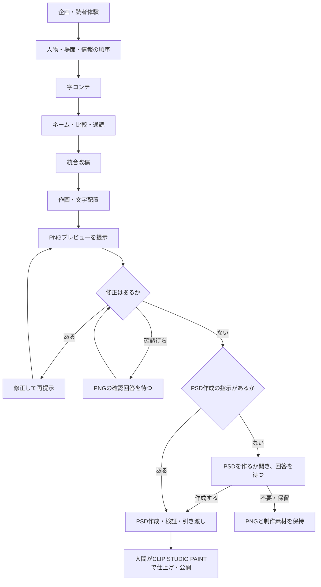

# 漫画制作キット

Codexと一緒に漫画を企画し、字コンテ・ネーム・作画・PNGでの確認を進めるための知識、7つのスキル、作品テンプレートです。作品ごとに独立した作業フォルダを作れます。

## できること

- 読者体験と物語を設計し、字コンテからネームへ具体化する。
- 物語、没入、映画的演出、読みやすさ、用語、キャラクターの一貫性をレビューする。
- 利用可能な画像生成・編集環境を使って作画し、PNGで確認・修正する。
- PNGの修正がなくなったら、作成指示のあるPSDを作成・検証して引き渡す。
- 動画で演出を試す依頼がある場合に、ローカルComfyUIの生成・回収と動画編集を補助する。

## 制作の流れ



工程ごとの成果物と確認点は[制作プロセス](docs/knowledge/manga/08-workflow-review.md)、知識と雛形は[ノウハウ一覧](templates/manga-project/docs/MANGA-KNOWHOW.md)にまとめています。「このフォルダで何ができるか」の説明は、この流れを入口にします。

## はじめ方

Windows PowerShell 5.1以上で、リポジトリのルートから実行します。

```powershell
.\scripts\New-MangaProject.ps1 -ProjectName '作品名' -WhatIf
.\scripts\New-MangaProject.ps1 -ProjectName '作品名'
```

既定の作成先は `../作品名/`。別の親フォルダを使う場合は、既存の相対パスを `-DestinationParent` で指定します。リポジトリのフォルダ名は自由に変更できます。既存の作品は上書きしません。

作成された作品をCodexで開き、`docs/story/BRIEF.md` に狙いを記して制作を始めます。共通知識とスキルは作品側へコピーされ、配布元への実行時依存はありません。

## 利用範囲

画像生成ツール、PSDを作成・再読込する手段、CLIP STUDIO PAINT、モデル本体は同梱していません。必要な環境を確認して進める手順を提供します。動画補助処理にはPython 3.10以上、編集にはffmpegとffprobeが必要です。

PSD作成の指示がなければ、PNGでの修正確認後に作るか質問して回答を待ちます。既に指示がある場合は再確認しません。CBZは明示指定時だけ作成します。フィードバックは「残してほしい」と依頼された場合だけ記録し、記録するかの確認はしません。

- [文書の入口](docs/README.md)
- [構成と配布](docs/architecture.md)
- [出典と取得日](docs/SOURCES.md)・[映画・脚本資料の参照範囲](docs/knowledge/manga-sources.md)
- [公開用の書き出しと検証](docs/publication.md)
- [利用条件と第三者資料](docs/RIGHTS.md)

現在の配布版は `distribution-version.txt` を参照してください。制作サンプルは同梱していません。
