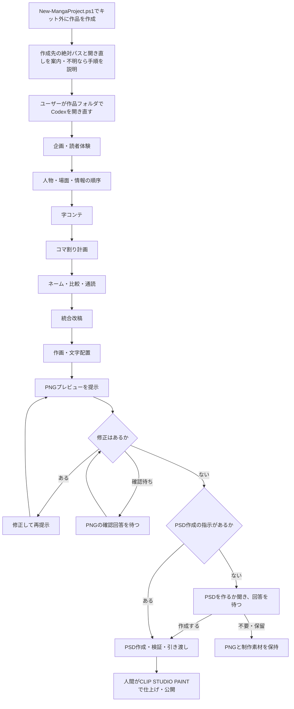

# 漫画制作キット

Codexと一緒に漫画を企画し、字コンテ・ネーム・作画・PNGでの確認を進めるための知識、8つのスキル、作品テンプレートです。

**基本は「キャラ・あらすじ・ページ数を指定して、インターネット公開用の漫画を作る」ことです。** 作品フォルダで指定すれば、追加設定なしで字コンテ・ネーム・作画・文字配置・全ページのPNG確認まで進められます。既定は右から左へ読む単ページ漫画、白地のPNGです。１ページ全体を生成する場合、使用ツールの生成画像の実寸に枠を合わせ、同じ寸法で書き出します。画像生成・編集に使える環境が必要です。

**このフォルダは制作キットの保守・配布用です。漫画は原則ここで描かず、`scripts/New-MangaProject.ps1` でキット外に個別プロジェクトを作成し、そちらでCodexを開き直して制作します。** `templates/manga-project/` は原本なので、直接作品を書き込まないでください。

尚、このリポジトリのURLを ChatGPT Work に指定して漫画のキャラクターやストーリーを指定するだけでも、おおよその機能を利用することができます。

## できること

個別プロジェクトを開いた後、次の制作を進められます。

- 読者体験と物語を設計し、字コンテからネームへ具体化する。
- コマ割りテンプレート集（全79種類）からページの形を選び、横長３段の過度な反復を防いで緩急をつける。
- 物語、没入、映画的演出、読みやすさ、用語、キャラクターの一貫性をレビューする。
- 場面で狙う笑い・魅力・感情・関係・展開について、監修スキルから字コンテの表現案とプレビュー後の改善案を得る。
- 利用可能な画像生成・編集環境を使って作画し、PNGで確認・修正する。
- PNGの修正がなくなったら、作成指示のあるPSDを作成・検証して引き渡す。
- 動画で演出を試す依頼がある場合に、ローカルComfyUIの生成・回収と動画編集を補助する。

## 制作の流れ

版0.3.2には [汎用ノウハウ](docs/knowledge/review-workflow.md#common-knowledge) と [場面ごとの監修](docs/knowledge/supervision/README.md) を収録しています。既存のギャグに加え、ツッコミ・非露骨な色気から、関係の変化、危機・逆転までの場面監修15テーマを試行版として追加しました。汎用知識は人物・情報・読みやすさ・終幕の判断に、監修スキルは狙う効果に応じた相談と画像レビューに使います。追加15テーマの一般的な読者効果は未検証で、作品ごとのPNGと試読で確かめます。



工程ごとの成果物と確認点は[制作プロセス](docs/knowledge/manga/08-workflow-review.md)、知識と雛形は[ノウハウ一覧](templates/manga-project/docs/MANGA-KNOWHOW.md)にまとめています。「このフォルダで何ができるか」の説明も、個別プロジェクトを作って開き直す流れから始めます。

## はじめ方

Windows PowerShell 5.1以上で、リポジトリのルートから実行します。

```powershell
.\scripts\New-MangaProject.ps1 -ProjectName '作品名' -WhatIf
.\scripts\New-MangaProject.ps1 -ProjectName '作品名'
```

既定の作成先は `../作品名/`。別の親フォルダを使う場合は、キット外に作成される既存の相対パスを `-DestinationParent` で指定します。リポジトリのフォルダ名は自由に変更できます。既存の作品は上書きしません。`-WhatIf` は配置の確認だけで、プロジェクトを作成しません。

作成成功時にスクリプトが**作成先の絶対パス**と、そこでCodexを開き直すメッセージを表示します。Codexが作成した場合も、作成先の実在を確認し、ユーザーへの返信に絶対パスを省略せず示します。これは開き直すための表示であり、文書・設定・保存記録は相対パスを使います。

### 作成したプロジェクトでCodexを開き直す

Codexは作成完了時に「このフォルダでCodexを開き直してください」と案内し、**「やり方がわからない場合は、ご利用の環境（Windows／Mac、アプリ／VS Code）を教えてください。必要な手順をご案内します」**と添えます。手順がわかる場合は返信せず、そのまま作品フォルダを開いて構いません。作成のたびに操作手順を調べることはせず、手順を求められた場合だけ、利用環境に合う最新の公式情報を検索・閲覧し、出典URLと確認日を付けて説明します。詳しくは[Codexでの開き直し](docs/knowledge/codex-operation.md#作品フォルダでcodexを開き直す)を参照してください。

表示された絶対パスの作品フォルダをアプリまたはVS Codeで開き、そこで新しいCodexの会話を始めます。作成スクリプトの実行だけでは、今の会話の作業フォルダは切り替わりません。作品側の `AGENTS.md`、`project.json`、`docs/PLAN.md`、`docs/PROGRESS.md` を確認してから、`docs/story/BRIEF.md` に狙いを記して制作を始めます。共通知識とスキルは作品側へコピーされ、配布元への実行時依存はありません。既存作品を再開する場合は、新規作成せずその作品フォルダを開きます。

### どうしてもこのキット内で漫画を作る場合の例外

通常は上記の個別プロジェクトを使います。ユーザーがどうしてもキット内で制作したいと明示した場合だけ、次の手順に進みます。

1. ユーザー自身がテキストエディターなどで、このキットのルートに `特別な理由でこのフォルダの中で漫画を作ります.txt` を作成します。拡張子の重複や別名になっていないことを確認してください。
2. Codexはその名前の通常のファイルが実在することを確認します。ファイルがない間は制作を始めません。Codexによる代作・コピー・生成コマンドの実行は行いません。
3. キット内で作るというユーザーの明示指示とファイルの存在がそろったら、例外として制作を始めます。ファイルが置かれているだけでは制作依頼と扱いません。

このファイルは雛形や新規作品へ配布せず、Gitのコミット対象から除外します。例外で作る素材・原稿も公開対象外の `.work/` などに保存し、共通知識・スキル・作品雛形へ混ぜません。キット自体の文書・スクリプトの修正や配布テストには、この例外ファイルは不要です。

## 利用範囲

作品フォルダでの依頼例：「キャラは○○と△△。あらすじは□□。8ページで、インターネット公開用の漫画を作って」。未指定の詳細は制作に合わせて仮決めするため、オプションの全項目に回答する必要はありません。PNGを確認し、修正希望を伝えてください。

用途や好みに合わせたい場合は [OPTION.md](templates/manga-project/OPTION.md) で、生成する画像の寸法・枠を合わせる寸法・最終PNGの寸法、余白、ガイド表示、文体推敲、コマ割り、文字方向などを選べます。既定では余白・線幅も枠配置寸法に連動します。2000×3000pxは枠素材原本の寸法で、完成PNGには別途指定できます。印刷専用の項目は [PRINT-OPTION.md](templates/manga-project/PRINT-OPTION.md) に分け、既定は使用しません。投稿先が決まっていれば、その条件も反映します。

[日本語推敲スキル](docs/knowledge/optional-skills.md)は既定で無効です。有効にすると、配布先を開いたCodexの最初の作業時に自動導入します。`humanizer-jp` はGitを使用し、Gitがなければインストールの許可を確認します。Gemini版の `japanese-natural-writing` は、利用環境があっても導入前にGeminiの利用枠を消費してよいか確認し、回答を待ちます。

NovelAIのOpusを使う場合は、１回１枚、28ステップ以下（V5は初期値23、V4.5以前は28）を既定とします。生成寸法は使用ツールに合わせ、枠と最終PNGは生成実寸に合わせます。採用寸法、V5の利用上限や参照等の追加料金を含む[Anlas消費の条件](docs/knowledge/ai-production.md#novelai-opus)を確認し、明示指示なしにAnlasを使う生成へ切り替えません。

PSDも必要な場合の依頼例：「PNG確認後、絵・フキダシ・文字を分けたPSDも作って」。実際に分離して制作した要素を動かせる形で渡します。文字が画像の場合は文字列を直接編集できないため、台詞原文も添えます。[PSDの編集範囲と確認方法](docs/knowledge/psd-handoff.md)を参照してください。

画像生成ツール、PSDを作成・再読込する手段、CLIP STUDIO PAINT、モデル本体は同梱していません。必要な環境を確認して進める手順を提供します。動画補助処理にはPython 3.10以上、編集にはffmpegとffprobeが必要です。

PSD作成の指示がなければ、PNGでの修正確認後に作るか質問して回答を待ちます。既に指示がある場合は再確認しません。CBZは明示指定時だけ作成します。フィードバックは「残してほしい」と依頼された場合だけ記録し、記録するかの確認はしません。

## よくある質問（FAQ）

### Q. このキットを使って作成した漫画を公開してよいですか？ また、キットを利用したことを記載（クレジット表記）する必要はありますか？
**A.** はい、公開していただけます。本キットを利用して作成された漫画作品について、本リポジトリの作者は、本キットを利用したことを理由として成果物に対する権利や追加の利用制限を主張しません。また、本キットを利用して漫画を作成したことのクレジット表記も任意であり、記載してもしなくても構いません。

ただし、政治的思想が強い内容や他者への攻撃性が強い内容を含む作品を公開される場合は、本キットとの関連を示すクレジット表記等はお控えいただけますと幸いです。これは利用を制限する条件ではなく、本リポジトリ作者からのお願いです。

なお、二次創作をはじめ、第三者の著作物・キャラクター・素材等を扱う場合は、それぞれの権利者が定めるガイドラインや利用条件をご確認ください。また、本キットは制作過程で各種AIサービスを利用することを前提としているため、利用するサービスやモデル等に適用される利用条件についても、利用者ご自身でご確認ください。

### Q. ChatGPTのどのモデルで使えばよいですか？
**A.** 作者は「ChatGPT Pro」プランにて「Astra ExtraHigh（極高）」を指定して試作・運用しています。「Ultra」でも検証を行いましたが、体感上の大きな差異は見られず、主に利用枠の消費が増加する印象でした。  
なお、SNS（X）上では「ChatGPT Plus」プランのWork画面にて、5時間制限の範囲内で16〜18ページ程度作成できたという報告もあります。
※上記は作者の環境・執筆時点での使用感、または執筆時点のSNS上の情報です。ChatGPTのモデル名称、利用可能な推論設定、利用上限等は今後変更される可能性があります。
※処理内容の複雑さや、Astra側の性能・制限の増減によって変動する可能性がある点にはご注意ください。

### Q. 制作開始時に指定できるパラメーターはありますか？
**A.** 作品プロジェクト内の `OPTION.md` をご参照ください。コマ割りテンプレートの利用有無、コマ数別の採用率、横長3段の反復制限、文字方向、PSD作成などのオプションが指定可能です。  
各設定によって実際にどのように挙動が変わるかについては、制作開始時などに `OPTION.md` についてCodexへ直接質問すると、各設定の内容について確認することもできます。
特に指定しない場合はデフォルト設定で動作します。

### Q. version 0.3.2の修正点は何ですか？
**A.** 場面の狙いから選べる監修として、ツッコミ・非露骨な色気から、関係の変化、危機・逆転までの場面監修15テーマを試行版として追加しました。出典・適用条件・比較案・代償を記載し、既存の `manga-supervision` から参照できます。資料調査と文章上の予備点検を行い、表現案・修正しない案・例外を比較しています。一般的な読者効果は未検証で、実作品PNGと試読による確認が必要です。

### Q. version 0.3.1の修正点は何ですか？
**A.** 人物・緩急・演技・読みやすさ・レビューのノウハウを拡充し、ギャグのノウハウを `docs/knowledge/supervision/gag/` に追加しました。この版の専用監修はギャグで、字コンテの表現相談とPNGプレビューの改善に対応しました。

### Q. version 0.3の修正点は何ですか？
**A.** 従来の挙動では1ページの中に縦3コマが並ぶ単調なパターンが多く発生していたため、事前に作成済みのコマ割りパターン集から選んで構成するよう改善しました。現在はデフォルトでこのパターン選択が有効になっています。  
あらかじめ用意されたパターンを使用せず自由にコマ割りを設計したい場合は、制作開始前にCodexへその旨をご指示いただくか、`OPTION.md` にて設定を変更してください。

## 関連ドキュメント

- [文書の入口](docs/README.md)
- [構成と配布](docs/architecture.md)
- [出典と取得日](docs/SOURCES.md)・[映画・脚本資料の参照範囲](docs/knowledge/manga-sources.md)
- [このフォルダからコミットする前の検証](docs/publication.md)
- [利用条件と第三者資料](docs/RIGHTS.md)

現在の配布版は `distribution-version.txt` を参照してください。[作例](examples/README.md)には公開用のPNGと制作条件の説明を収録しています。作例は閲覧用で、新規作品プロジェクトにはコピーしません。
