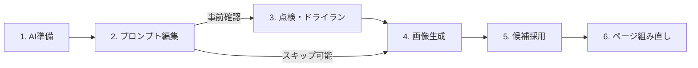

# NovelAIのキャラクター・絵柄・背景を編集して再生成する

このガイドは、**NovelAI用のプロンプト組み立てが完了している作品**、または**漫画のPNGプレビューが完成している作品**において、キャラクターの外見・絵柄・背景などの見た目を変更し、画像を再生成してページを組み直すための手順書です。既存の作品フォルダで作業します。

作品フォルダ内の `.env` や編集用テキストを変更することで、プロンプトの共通部分（キャラクターの髪型や服装、画風、背景など）を一括で差し替えられます。

> [!NOTE]
> 本手順は、**AIエージェント（Codex、Claude Code、Antigravityなど）に環境準備や点検を依頼し、ユーザーが変更内容を決めて進める**スタイルを標準としています。
> 各段階のコマンド実行は、ご自身でターミナルから行うことも、AIエージェントへ依頼して任せることも可能です。なお、準備を依頼しただけで画像生成や有料利用を許可したことにはなりません。

---

## 【最短手順】キャラクターの見た目だけを変更する（クイックスタート）

キャラクターの見た目を素早く変更したい場合の手順です。
**初回のみAIエージェントへ環境準備を依頼**し、準備完了後（2回目以降）は **Step 1 〜 Step 4** だけで完了します。

### 【初回のみ】Step 0. AIエージェントへ準備を依頼する
作品でまだプロンプトが変数化されていない場合は、作品フォルダでAIエージェントに以下のように依頼してください（**この作業は基本的に作品ごとに初回1回だけ必要**です。すでに `.env` に変数がある場合はスキップして Step 1 へ進んでください。尚、元となるプロンプト組み立てを大きく変更した場合は、再度本手順をやり直す必要がある可能性があります）。

> 🤖 **AIへの依頼文例：**
> 「既存のプロンプトをもとに、キャラクター・絵柄・背景を `.env` から自分で編集できるように準備してください。今回は画像の生成は行わず、準備だけお願いします。」

---

### Step 1. `.env` のキャラクター変数を書き換える
作品フォルダ直下の `.env` をテキストエディタで開き、該当キャラクターの行の右側（`"` の中）を書き換えて保存します（UTF-8、改行なしの1行）：
```dotenv
NOVELAI_CHAR_MIO="girl, black twintails, blue jacket"
```
UTF-8かどうか判断できない場合は、日本語を書かず半角の英語や記号のみにしてください。

### Step 2. 画像を再生成する
作品フォルダのターミナルで以下を実行します。**今回の全設定が0 Anlasで、V5の無料利用枠も足りていることを確認済みの場合だけ**実行してください（確認の方法は [6. 費用・利用枠の確認と生成の実行](#6-費用利用枠の確認と生成の実行)）。`--confirm-zero-anlas` と `--confirm-v5-allowance` は確認済みの宣言で、コマンドが0 Anlasを確認するわけではありません。`--cost-note` は、実際に確認した方法と日時に書き換えてください。V4.5の場合は `--confirm-v5-allowance` を外します：
```powershell
python -X utf8 scripts/novelai_batch.py generate --page 1 --execute --accept-warnings --confirm-zero-anlas --confirm-v5-allowance --cost-note '今回の全設定の費用と利用枠を確認した方法・日時を記入'
```
> 🤖 **AIへ依頼する場合：**「ミオの見た目を変更したので、1ページ目をNovelAIで再生成してください（0 Anlas・無料枠内のみ）。」

### Step 3. 新しい候補画像を採用する
生成された画像を確認し、各コマの最新画像を採用します：
```powershell
python -X utf8 scripts/novelai_batch.py adopt-latest --page 1
```
全ページを一括で最新画像を採用したい場合は以下のコマンドを実行します：
```powershell
python -X utf8 scripts/novelai_batch.py adopt-latest --all
```

> 🤖 **AIへ依頼する場合：**「各コマで最新（最大番号）の画像を採用してください。」

### Step 4. ページPNGを組み直す
```powershell
python -X utf8 scripts/novelai_batch.py build --page 1
```
`output/build/page-01/v001/` のように版ごとのフォルダへ出力されます。最新の版のページPNGを開いて仕上がりを確認します。

PNGに修正がないことを確認した後、CLIP STUDIO PAINTなどで調整するPSDが必要な場合は、`--write-psd` を付けて組み直します：
```powershell
python -X utf8 scripts/novelai_batch.py build --page 1 --write-psd
```
PSDは新しい版のフォルダ（例：`output/build/page-01/v002/page-01.psd`）に、ページPNGと一緒に保存されます。PNGの確認前には作成しません（詳しくは [8. ページPNGの組み直しと仕上がり確認](#8-ページpngの組み直しと仕上がり確認)）。

各ページをページ送りで確認したいときは、AIエージェントにHTMLの作成を依頼できます（詳しくは [8. ページPNGの組み直しと仕上がり確認](#8-ページpngの組み直しと仕上がり確認)）。

> [!TIP]
> **手順全体や詳しい仕組みを確認したい方へ**
> 背景や絵柄の変更方法、テキストファイルを使った安全な編集方法（方法B）、事前の構文点検（ドライラン）、各コマンドの詳細なオプションなど、手順全体をしっかり確認したい場合は、次の「[役割分担と全体の流れ](#役割分担と全体の流れ)」から順にお読みください。

---

## 役割分担と全体の流れ

| 作業内容 | 主な担当 | 備考 |
| --- | --- | --- |
| 既存プロンプトの変数化・要求JSONへの参照設定・編集用テキスト作成 | **AIエージェント** | 初回の環境構築 |
| 変更する外見・絵柄・背景の決定、本文の編集 | **あなた** | `.env` またはテキストファイルを編集 |
| 展開後の要求と構文警告の点検・送信なし確認（ドライラン） | **あなた または AI** | **スキップ可能（任意）**。生成前の事前確認を行いたい場合に実施 |
| 費用（Anlas）・利用枠の確認、生成の実行判断 | **あなた** | AIは確認と判断を支援 |
| 生成・採用・Buildコマンドの実行 | **あなた または AI** | ご自身で実行、またはAIへ依頼 |
| 候補画像の選択、完成ページPNGの修正確認、PSD作成指示 | **あなた** | 画像・仕上がりを見て判断 |



> [!IMPORTANT]
> **設定を編集しただけでは、既存の生成画像は変わりません。**
> プロンプト変更後は、**生成 → 採用 → ページの組み直し（Build）** を行って初めて完成ページが更新されます。

---

## 1. 最初の準備（AIエージェントへ依頼）

既存の作品フォルダでAIエージェントを開き、以下のように依頼してください。
（すでに準備が完了している場合は、編集ファイルとコマンドの場所をAIへ確認し、[3. コマンドの実行場所を確認する](#3-コマンドの実行場所を確認する) へ進んでください）

> **AIへの依頼文例：**
> 「この作品はNovelAI用のプロンプト組み立て（またはPNGプレビュー）まで完了しています。既存のプロンプトをもとに、キャラクター・絵柄・背景を `.env` から自分で編集できるように準備してください。
> 変数名・現在の本文・影響するコマを私に示し、確認後に要求JSONへの参照設定と編集用UTF-8テキストの作成をお願いします。既存の画像・採用記録・ページ構成は保持してください。
> 私が編集するファイルと実行するコマンドを `docs/production/NOVELAI-BATCH.md` に残して案内してください。今回は画像を生成せず、準備だけお願いします。」

AIエージェントが作品の設定に合わせて変数化を行い、編集対象ファイルやコマンドの場所を案内します。

---

## 2. 変更できる項目（プロンプト変数）

プロンプト内の共通要素を「変数（`${変数名}`）」として切り出して管理します。変数名には半角英大文字・数字・アンダースコアを使用します。

| 種類 | 変数名の例 | 変更できる内容 |
| --- | --- | --- |
| **キャラクター** | `NOVELAI_CHAR_MIO` | 髪型、髪色、服、装飾などキャラクター固有の外見 |
| **絵柄・画風** | `NOVELAI_STYLE_MAIN` | 線画のタッチ、塗り、色彩、全体の画風 |
| **背景** | `NOVELAI_BACKGROUND_CLASSROOM` | 教室の机、窓、時間帯や光の描写など |

### 要求JSON内での展開の仕組み
要求JSONへの変数参照の設定は **AIエージェントが担当** します（ユーザーが直接JSONを編集する必要はありません）。

```text
Base（共通背景・絵柄） : 1girl, standing, ${NOVELAI_BACKGROUND_CLASSROOM}, ${NOVELAI_STYLE_MAIN}
Character（人物外見）  : ${NOVELAI_CHAR_MIO}, smiling, on the left
```

- 絵柄や背景は場面共通の文章（Base）へ、キャラクター外見は対応する人物別の文章（Character）へ配置されます。
- ポーズ・表情・構図などはコマごとの個別要求に残されるため、外見や画風だけを綺麗に差し替えられます。
- 背景変数は場所ごと（教室、廊下など）に分かれます。例えば教室の変数を変更しても、教室以外のコマには影響しません。

---

## 3. コマンドの実行場所を確認する

コマンドをご自身で実行する場合は、**作品フォルダを作業場所（カレントディレクトリ）にしたターミナル（PowerShell等）** で実行します。
（※すべてのコマンド実行をAIエージェントへ任せる場合は、このターミナル操作は不要です）

> **ヒント（Windows）**: エクスプローラーで作品フォルダを開き、アドレスバーに `powershell` と入力して Enter を押すと、そのフォルダを作業場所としてターミナルが開きます。

ターミナルが開いたら、以下のコマンドを実行して作業場所を確認します：

```powershell
Get-Location
Test-Path project.json
Test-Path scripts/novelai_batch.py
```

- 1行目の表示が作品フォルダのパスになっていること
- 続く2つの結果が両方とも `True` であること

を確認してください。`False` が表示された場合は作業フォルダが異なっているため、作品フォルダ直下で開き直してください。

---

## 4. 編集方法を選び、プロンプトを変更する

編集方法は **方法A（`.env` を直接編集）** と **方法B（テキストファイルを編集して反映）** の2通りがあります。お好みの方法を1つ選んでください。

### 方法A：`.env` を直接編集する（最も手軽）

作品フォルダ直下にある `.env` ファイルをテキストエディタで開きます。
（※`.env.example` は見本ファイルです。編集しても設定には反映されません）

```dotenv
# 変更前の例：
NOVELAI_CHAR_MIO="girl, short black hair, blue jacket"
NOVELAI_STYLE_MAIN="clean lineart, soft colors, anime style"
NOVELAI_BACKGROUND_CLASSROOM="classroom, desks, windows, daylight"

# 変更後の例：
NOVELAI_CHAR_MIO="girl, black twintails, blue jacket"
NOVELAI_STYLE_MAIN="bold lineart, vivid colors, cel shading"
NOVELAI_BACKGROUND_CLASSROOM="classroom, desks, windows, warm sunset light"
```

- `=` の左側の変数名は変更せず、**右側の引用符（`"`）の中だけ** を編集します。
- 各設定は必ず1行で書き、途中で改行しないでください。文字コードは UTF-8 で保存します。
- APIキー等の他の設定行は触らないでください。
- **反映コマンドは不要** です（保存するだけで設定が有効になります）。

---

### 方法B：テキストファイルを編集して `.env` へ反映する（安全）

`.env` を直接触りたくない場合は、手順1でAIエージェントが作成したテキストファイルを編集します。

例えば `input/novelai/prompts/mio.txt` を開き、以下の本文だけを書いて UTF-8 で保存します（変数名や `=`、外側の引用符は不要です）：

```text
girl, black twintails, blue jacket
```

| テキストファイルの例 | 本文の記述例 |
| --- | --- |
| `input/novelai/prompts/style-main.txt` | `bold lineart, vivid colors, cel shading` |
| `input/novelai/prompts/background-classroom.txt` | `classroom, desks, windows, warm sunset light` |

編集・保存後、ターミナルで以下のコマンドを実行して `.env` に反映します（変更したファイルのみの実行で構いません）：

```powershell
python -X utf8 scripts/novelai_batch.py env-set NOVELAI_CHAR_MIO --value-file input/novelai/prompts/mio.txt
python -X utf8 scripts/novelai_batch.py env-set NOVELAI_STYLE_MAIN --value-file input/novelai/prompts/style-main.txt
python -X utf8 scripts/novelai_batch.py env-set NOVELAI_BACKGROUND_CLASSROOM --value-file input/novelai/prompts/background-classroom.txt
```

実行後、「更新しました」または「追加しました」と表示されることを確認します。

> [!IMPORTANT]
> **テキストファイルの内容は自動同期されません。**
> テキストを編集するたびに `env-set` コマンドを実行（またはAIへ依頼）してください。

> **AIへ反映を依頼する場合の文例：**
> 「編集用テキストを保存しました。変更したファイルを確認し、`env-set` で `.env` に反映してください。画像は生成しないでください。」

---

### 日本語で入力する場合
プロンプト本文や編集用テキストには、日本語をそのまま書くことも可能です（例: `女の子、黒髪のツインテール、青いジャケット`）。
スクリプトは翻訳を行わず、そのまま要求へ組み込みます。狙った外見が出ているか確認し、必要に応じて英語プロンプトへの調整をAIに相談してください。

> [!TIP]
> プロンプトの編集が完了したら、任意で次の [5. 設定の点検と送信なし確認（ドライラン）](#5-設定の点検と送信なし確認ドライラン) を行うか、または**点検をスキップして直接 [6. 費用・利用枠の確認と生成の実行](#6-費用利用枠の確認と生成の実行) へ進むことも可能**です。（※方法Bでテキストファイルを編集した場合は、`env-set` による `.env` への反映を済ませてから進んでください）

---

## 5. 設定の点検と送信なし確認（ドライラン）

> [!TIP]
> **この手順はスキップ可能です（任意）。**
> プロンプト記述に慣れている場合や、事前のシミュレーションを行わずにすぐ生成へ進みたい場合は、この手順をスキップして直接 [6. 費用・利用枠の確認と生成の実行](#6-費用利用枠の確認と生成の実行) へ進んで構いません。（※方法Bでテキストファイルを編集した場合は、`.env` への反映（`env-set`）を済ませた上で進んでください）

プロンプトを変更したら、実際に画像生成を行う前に設定の整合性チェックやドライラン（通信なしのシミュレーション）を行うことができます。

### 1. AIエージェントに内容点検を依頼
変更した項目をAIへ伝え、展開後の要求JSONの点検を依頼します。

> **AIへの依頼文例：**
> 「ミオの髪型を黒髪ツインテールに変更し、絵柄と教室の光も変更しました。`.env` に合わせて展開後の要求を点検してください。人物別入力への割り当てと場面のつながりも確認をお願いします。今回は画像を生成しないでください。」

### 2. 登録変数の確認
ターミナルで登録済みの変数一覧を確認します：

```powershell
# 登録変数の一覧（名前・取得元・文字数）
python -X utf8 scripts/novelai_batch.py vars

# 変数の値（プロンプト本文）も含めて表示
python -X utf8 scripts/novelai_batch.py vars --show-values
```
※APIキー等の機密情報は表示されません。

### 3. 送信なし確認（ドライラン）
NovelAIサーバーへは送信せず、1ページ目の要求内容をローカルで確認します：

```powershell
python -X utf8 scripts/novelai_batch.py generate --page 1
```

画像生成は行われず、寸法・Seed値・使用変数・構文警告が表示され、最後に「送信なし」と表示されます。
警告やエラーが出た場合は、内容をAIエージェントへ伝えて修正を依頼してください。

> **AIへコマンド実行と確認を任せる場合の依頼文例：**
> 「`vars` と `generate --page 1` による送信なし確認を行い、設定と警告を確認してください。必要な修正に対応し、画像生成は行わないでください。」

### プロンプト警告（Lint）について
スクリプトは、意図が画像に出にくい書き方を自動検出して警告します：
- **肯定側に否定語**: `not`, `without` など（逆に出てしまう原因になります。`negative_prompt` へ移すか、人物なしは `no humans` を使います）
- **意図の表現**: `as if`, `trying to`, `awkwardly` など（目に見える具体的な顔・手・体の描写に直します）
- **数値の年齢・man/woman**: 見た目に効きにくく、別の人物が増える原因になります（`1girl`, `1boy` 等を使用します）

警告が出た場合、原則としてAIエージェントがプロンプトを修正します。意図して残す場合は、生成時に `--accept-warnings` を付与して送信します。

> **キャラクター識別特徴の点検（オプション）**:
> キャラクターの識別特徴（髪・服など）の自動点検は既定では無効です。使いたい場合のみ、`.env` に `NOVELAI_CHECK_IDENTITY=1` を設定します。その場合、AIエージェントが `input/novelai/characters.json` の特徴語を新しいプロンプトと同期させます。

---

## 6. 費用・利用枠の確認と生成の実行

### 費用・利用枠の事前確認
生成を行う前に、**今回の全設定（モデル・寸法・ステップ数等）が 0 Anlas であること**、および **V5の無料利用枠が足りていること** を必ず確認してください。
（Opus契約中であっても、設定寸法やステップ数によっては追加Anlasを消費する場合があります）

> [!CAUTION]
> 費用や利用枠が未確認の状態で生成を実行してはなりません。確認できない場合は、生成を保留して確認を行ってください。

> **契約・Anlas・V5利用枠の照会頻度について**:
> API呼び出しの過剰な増加を避けるため、照会APIは生成のたびではなく「最初の生成時」に呼び出し、以後は目安10回の生成ごとに1回自動で照会されます。
> ただし、モデル・寸法・ステップ数・枚数・追加機能を変更した際や、前回の生成が失敗または完了を確認できなかった際、V5利用枠が少ない際（残り3%以下）は10回を待たずに照会されます。強制的に再照会したい場合は `output/novelai/subscription-check.json` を削除してください。

### 生成コマンドの実行

全設定が 0 Anlas で、V5利用枠も確認できた場合のみ、生成コマンドを実行します。
（`--cost-note` の内容は、実際に確認した方法と日時に書き換えてください）

**NovelAI V5 の場合：**
```powershell
python -X utf8 scripts/novelai_batch.py generate --page 1 --execute --accept-warnings --confirm-zero-anlas --confirm-v5-allowance --cost-note '今回の全設定の費用と利用枠を確認した方法・日時を記入'
```

**NovelAI V4 / V4.5 の場合：**
（`--confirm-v5-allowance` を外して実行します）
```powershell
python -X utf8 scripts/novelai_batch.py generate --page 1 --execute --accept-warnings --confirm-zero-anlas --cost-note '今回の全設定の費用を確認した方法・日時を記入'
```

- `--execute`: 実際にNovelAIへ生成リクエストを送信します。
- 1ページの各コマが1枚ずつ順に生成され、`output/novelai/candidates/<コマID>/` に連番（`r001.png`, `r002.png`...）で保存されます。既存の画像は上書きされません。
- 途中でエラーが発生した場合、スクリプトは安全のため停止し、自動再送は行いません。

> **AIへ生成を任せる場合の依頼文例：**
> 「変更後の1ページ目をNovelAIで生成してください。今回の全設定で 0 Anlas を確認でき、V5なら利用枠も足りる場合だけ実行してください。確認できなければ送信せず教えてください。有料利用と失敗時の自動再送は許可しません。」

#### Seed（シード値）について
普段の再生成では、Seed（生成のばらつきを決める乱数）が変わり、新たな構図や表情が試されます。
「前回の構図を保ったまま、プロンプト変更（髪型や色など）の影響だけを比べたい」場合は、AIエージェントに依頼して `--seed request` を付けた同一Seedでの比較を行ってください。

---

## 7. 候補画像の確認と採用

生成が完了したら、生成された候補画像を確認し、ページに組み込む画像を採用します。

### 1. 候補と採用状況の確認
```powershell
python -X utf8 scripts/novelai_batch.py list --page 1
```
各コマの候補数や、現在採用されている画像が表示されます。

### 2. 候補画像の目視確認
候補画像は `output/novelai/candidates/<コマID>/` に保存されています。
（例: 1ページ目2コマ目なら `output/novelai/candidates/p01-02/r003.png`）

画像ビューアで画像を開き、外見・背景・動作・人物の位置を確認して、採用する候補番号（`r003.png` なら `3`）を決めます。

### 3. 画像の採用コマンドを実行

**コマごとに個別に採用する場合：**
```powershell
# p01-02（1ページ目2コマ目）に候補3（r003.png）を採用
python -X utf8 scripts/novelai_batch.py adopt p01-02 --candidate 3
```

### 各フォルダの最新番号をまとめて採用する

<a id="各フォルダの最新番号をまとめて採用する"></a>

再生成した最新の画像をまとめて適用したい場合は、以下の `adopt-latest` コマンドを使用します：

```powershell
# 対象を表示するだけ（採用記録は変更しないドライラン）
python -X utf8 scripts/novelai_batch.py adopt-latest --page 1 --dry-run

# 1ページ目の各コマで最大番号のPNGを採用
python -X utf8 scripts/novelai_batch.py adopt-latest --page 1

# 全ページのコマで最大番号のPNGを採用
python -X utf8 scripts/novelai_batch.py adopt-latest --all

# 一部のコマだけ再生成した場合は、要求IDを指定して採用
python -X utf8 scripts/novelai_batch.py adopt-latest --ids p01-02,p01-04
```

- 「最新」は更新日時ではなく候補番号（最大番号）で判定されます。
- `input/novelai/adopted.json` の対象コマの採用記録が更新されます。

> [!NOTE]
> 画像を再生成しただけでは採用画像は切り替わりません。採用を行わずに次へ進むと、古い画像でページが組み直されてしまいます。

> **AIへ採用の記録を任せる場合の依頼文例：**
> 「画像を確認しました。p01-02は候補3を使います。他のコマは最新（最大番号）の画像を採用します。`adopt` で記録してください。」
> （※AIへ画像レビューを依頼した場合、AIが画像を開いて確認し、採用案を提示することも可能です）

---

## 8. ページPNGの組み直しと仕上がり確認

採用画像の記録が終わったら、コマ画像・フキダシ・文字を合成して完成ページPNGを組み直します。

```powershell
python -X utf8 scripts/novelai_batch.py build --page 1
```

- 組み直されたページPNGは `output/build/page-01/v001/` のように版ごとのフォルダへ保存されます。
- 保存先のページPNGを開き、切り抜き後の見え方・文字・読み順を確認してください。
- （※`build` コマンドはローカル合成処理であり、NovelAIへの通信は行いません）

> **画像生成前から始めた作品の場合**:
> ページ構成・文字配置・組版環境が未準備の場合は、事前にAIエージェントへ準備を依頼してください。必要な構成が整った後に `build` を実行します。

> **AIへ組み直しと点検を任せる場合の依頼文例：**
> 「採用した画像で1ページ目のPNGを組み直し、完成ページを点検して提示してください。ページ構成や文字配置が未準備なら先に整えてください。今回はPSDは作らないでください。」

修正がある場合はAIエージェントへ修正箇所を伝え、再提示された最新PNGを確認します。

### 各ページをページ送りで確認するHTML
複数ページを順に見比べたいときは、AIエージェントにページ送り用のHTMLを作ってもらえます。AIは `output/build/` の各ページの最新の版を集め、`output/build/preview.html` を作ります（前後のボタン・矢印キー・ページ選択つき。右から左へ読む作品では ← が次のページです）。再度 `build` で組み直したら、作り直しを依頼してください。AIはブラウザーを起動しないため、表示された場所のHTMLをご自身で開いてください。

> **AIへHTML作成を任せる場合の依頼文例：**
> 「組み直した各ページのPNGを、ページ送りしながら確認できるHTMLにしてください。novelai-composed-production.md の『PNGプレビューをページ送りで確認するHTML』に従い、最新の版だけを集めて、開く場所を教えてください。ブラウザーは起動しないでください。」

### 調整用PSDを作成する場合
クリスタ（CLIP STUDIO PAINT）などのペイントソフトで調整するためのPSDを作成する場合は、`--write-psd` を付けて実行します：

```powershell
python -X utf8 scripts/novelai_batch.py build --page 1 --write-psd
```

> [!TIP]
> 原則として、まずPNGプレビューで修正がないことを確認してからPSDの作成へ進みます。AIへPSD作成を依頼する場合は、「このPNGは修正なしです。PSDも作成・検証して引き渡してください」と伝えます。

---

## よくあるエラーと対処法（トラブルシューティング）

| 表示・状況 | 主な原因 | 対処法 |
| --- | --- | --- |
| **使えない変数名** | 命名規則に合わない変数名が指定された | 変数名は `NOVELAI_CHAR_` / `NOVELAI_STYLE_` / `NOVELAI_BACKGROUND_` のいずれかで始める必要があります。AIにスクリプトの対応状況を確認してください。 |
| **変数 ○○ が .env 等にありません** / **変数 ○○ がありません** | 設定したはずの変数が見つからない | テキスト編集（方法B）の場合、`env-set` での反映を済ませたか確認してください。要求JSON側の参照設定に問題があればAIへ修正を依頼してください。 |
| **同じ変数が複数の場所にあります** | 複数の設定ファイルで変数が重複している | `.env`、`.secrets/novelai.env`、環境変数などで重複していないかAIへ整理を依頼し、1箇所へ揃えてください。 |
| **値は１行にしてください** | プロンプト本文の途中に改行が含まれている | 編集したテキストの改行を削除し、必ず1行で保存してください。 |
| **`FileNotFoundError`** | `env-set --value-file` で指定したテキストのパスが存在しない | AIから案内されたファイルパス（`input/novelai/prompts/...`）と反映コマンドを再確認してください。 |
| **設定を変えたのに画像が変わらない** | 生成・採用・Buildのいずれかが未完了 | ①再生成を行いましたか？<br>②新しい候補を `adopt` で採用しましたか？<br>③最後に `build` を実行しましたか？ 順を追って確認してください。 |
| **buildが失敗する** | 採用情報やページ構成・組版環境に不備がある | エラー内容をAIへ伝えてください。採用状態、`input/pages/page-01.json`、文字配置、フォント等の組版環境を確認してもらいます。 |

> **`templatize` について**:
> 要求JSON内の同一テキストを変数（`${変数名}`）へ一括置換する `templatize` コマンドは、初回の環境準備時にAIエージェントが使用するものです。通常の編集作業でユーザーが実行する必要はありません。

---

## 付録A：引数から要求JSONを作る・.envで補助設定を変える

新規にコマの要求JSONを組み立てる場合や、スクリプトから直接パラメータを渡して作成する場合は、標準の組み立てスクリプト `scripts/novelai_compose.py` を使用できます。モデルはV5が既定です。

```powershell
python -X utf8 scripts/novelai_compose.py --id p01-03 --seed 123 `
  --scene "upper body" --background "classroom, daylight" --style "bold lineart, vivid colors" `
  --char1-appearance "black twintails" --char1-action "smile" --char1-pos 0.3,0.5 `
  --char2-appearance "short blue hair" --char2-action "looking aside" --char2-pos 0.7,0.5
```

人物の種類（既定は `girl`。`--charN-type` で `boy`・`other`）は自動で先頭に付くため、`--charN-appearance` には書きません。モデルの既定はV5 Curatedで、V4.5はユーザーが指定した場合だけ使います（`--model`）。

組み立てられた要求は `input/novelai/requests/p01-03.json` に保存されます（この時点では通信しません。生成は手順6のコマンドで行います）。

また、`.env` に以下を記述することで、品質タグや除外（ネガティブ）プリセットを好みに応じてカスタマイズできます（未記述の場合は画面の既定値が使われます）：

```dotenv
# 品質タグの全文（空にすると付与しない）
NOVELAI_QUALITY_TAGS="very aesthetic, masterpiece, no text"

# 除外プリセット名（heavy, none。light, human はV5 Curatedのみ）
NOVELAI_UC_PRESET="heavy"

# 除外プリセットの全文指定（指定時はUC_PRESETより優先）
NOVELAI_UC_PRESET_TEXT="lowres, bad anatomy"

# 識別特徴の自動点検を行う場合（1で有効、既定は行わない）
NOVELAI_CHECK_IDENTITY=1
```

詳細な引数や仕様は [NovelAI制作手順](../knowledge/novelai-composed-production.md#compose) および [API手順](../knowledge/novelai-api.md#compose-standard) を参照してください。

---

## 付録B：実際に送信したリクエスト内容を確認する

生成を行うたびに、候補PNGと同じフォルダ（例: `output/novelai/candidates/p01-02/`）に以下の2つのJSONファイルが保存されます：

- `r003.request.json`：読みやすく整形された要求設定。Web画面の設定と見比べたいときや、今回の内容をもとに自分で微調整したいときに便利です。
- `r003.request-body.json`：NovelAI APIエンドポイントへ実際に送信された生データ。

意図通りの絵柄にならない場合の原因調査やパラメータ検証に役立ちます。また、`r003.request.json` を `input/novelai/requests/` へコピーして編集することで、新しい要求として再生成することも可能です。

---

- **手順の正本**: [NovelAI制作手順](../knowledge/novelai-composed-production.md#character-variables)
- **作品ごとのコマンドと採用記録**: [NovelAI一括生成の記録](../production/NOVELAI-BATCH.md)
